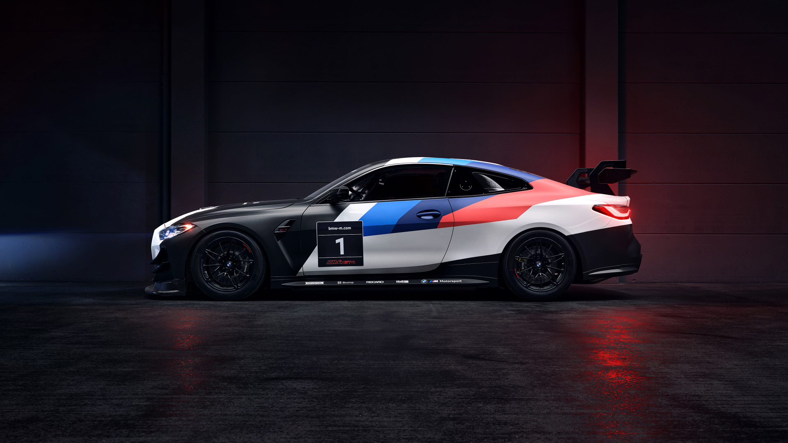

# Automotive Showcase: A Conceptual Brand Experience

 


> This is a conceptual portfolio project designed to showcase advanced frontend development skills. **This website is not affiliated with, nor endorsed by, BMW AG.** All assets used are for educational and demonstrative purposes only.

**Live Demo URL:** [https://automotive-showcase.vercel.app/](https://automotive-showcase.vercel.app/) 

---

## About The Project

This project is a fully responsive, highly animated, and immersive digital experience for a conceptual automotive brand. It was built from the ground up to demonstrate a modern, professional frontend workflow, focusing on performance, rich user interactions, and a strong, futuristic design aesthetic inspired by the high-performance automotive world.

The goal was not just to build a static page, but a multi-chapter narrative that takes the user on a journey - from a powerful first impression to exploring the brand's legacy, anatomy, and unique features.

## Key Features

*   **Immersive Hero Section:** A full-screen video background with an animated, tri-color gradient headline and a subtle startup sound effect to set the tone.
*   **Infinite Car Showcase:** A seamlessly looping, CSS-driven carousel of the car lineup. The animation pauses on hover, revealing a glowing tri-color border and the car's name.
*   **"Scroll Evolve" Legacy Timeline:** A cinematic timeline where the content and path evolve based on the user's scroll position, creating a narrative storytelling effect.
*   **Interactive Anatomy Explorer:** Users can hover over hotspots on the car to reveal details about its key engineering features.
*   **Performance-Optimized:** Attention was paid to performance by using optimized video assets, efficient animations (CSS for loops, Framer Motion for interactions), and modern Next.js features.
*   **Fully Responsive Design:** Every component is designed to be fully functional and aesthetically pleasing across all devices, from mobile phones to high-resolution desktops.
*   **Persistent Visual Identity:** A fixed tri-color bar and a "digital cockpit" background grid create a cohesive and branded feel throughout the entire experience.

---

## Tech Stack

This project leverages a modern, industry-standard technology stack to achieve its performance and design goals.

*   **[Next.js](https://nextjs.org/):** A powerful React framework providing Server-Side Rendering (SSR), static site generation, and a seamless developer experience.
*   **[React](https://reactjs.org/):** The core UI library for building components.
*   **[TypeScript](https://www.typescriptlang.org/):** For adding static types to JavaScript, improving code quality and maintainability.
*   **[Tailwind CSS](https://tailwindcss.com/):** A utility-first CSS framework for rapid, custom UI development without leaving the HTML.
*   **[Framer Motion](https://www.framer.com/motion/):** A production-ready motion library for React, used for all complex UI animations and interactive effects.

---

## Getting Started

To run this project locally on your machine, follow these steps:

### Prerequisites

Make sure you have Node.js (version 18.x or higher) and npm installed on your system.

### Installation

1.  **Clone the repository:**
    ```sh
    git clone https://github.com/nadhish2023/FUTURE_FS_03.git
    ```

2.  **Navigate to the project directory:**
    ```sh
    cd automotive-showcase
    ```

3.  **Install the dependencies:**
    ```sh
    npm install
    ```

4.  **Run the development server:**
    ```sh
    npm run dev
    ```

The application will be available at `http://localhost:3000`.

---